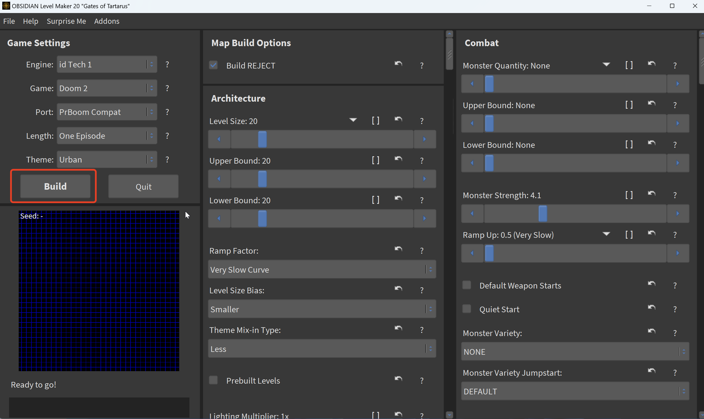

# AiMDoom


This repository contains the AiMDoom dataset and the toolkit used to generate this dataset.

## Dataset

The AiMDoom dataset can be downloaded from [this Google Drive link](https://drive.google.com/drive/folders/1fwhCrxmrJnpdK-egawoX2OYHUxnxAwr-?usp=sharing).

### Dataset Structure

```
AiMDoom_difficulty level
├── Training dataset
│   └── Scene name
│       ├── Scene_name.mtl
│       ├── Scene_name.obj
│       ├── setting.json
│       └── new_texture.png
└── Test dataset
```

## Toolkit

Clone this repository and note that running the following code requires a Python 2.7 environment.

This toolkit is developed based on the code from [devinacker/omgifol](https://github.com/devinacker/omgifol).

The following tools and steps are used to generate the AiMDoom dataset:

### 1. Generate DOOM Maps with OBSIDIAN

First, download [OBSIDIAN](https://obsidian-level-maker.github.io/), an open-source software used to generate DOOM map source files (WAD files).



### 2. Convert WAD Files to Mesh Files

The next step is to convert WAD files to mesh files. This extracts textures and map geometry from a WAD file into an OBJ file, MTL file, and PNG files.

```
python omgifol/demo/wad2obj.py -s /path/to/your/folder
```

### 3. Reorganize 3D Scene Collections

This script essentially reorganizes 3D scene collections by separating each OBJ file into its own folder with properly structured texture references.

```
python script.py /path/to/your/folder
```

### 4. Clean Up 3D Scenes with Blender

Download Blender version 4.1.1 or higher. The script essentially cleans up 3D scenes by trimming excess geometry and keeping only the main connected part of each scene.

```
blender-4.1.1/blender -b --python blender_process.py -- /path/to/your/folder
```

### 5. Texture Baking

Finally, perform texture baking to allow the models to be processed directly by most mainstream 3D libraries like PyTorch3D. This script essentially simplifies 3D models by baking all texture information into a single unified texture, making them more efficient and easier to work with.

```
blender-4.1.1/blender -b --warm_texture_images.py -- /path/to/your/folder
```

## License
This dataset is licensed under the [Creative Commons Attribution 4.0 International License (CC BY 4.0)](https://creativecommons.org/licenses/by/4.0/).
If you use this dataset or our code, please cite the following paper:

```
@article{li2025nextbestpath,
  title={NextBestPath: Efficient 3D Mapping of Unseen Environments},
  author={Li, Shiyao and Gu{\'e}don, Antoine and Boittiaux, Cl{\'e}mentin and Chen, Shizhe and Lepetit, Vincent},
  journal={arXiv preprint arXiv:2502.05378},
  year={2025}
}
```